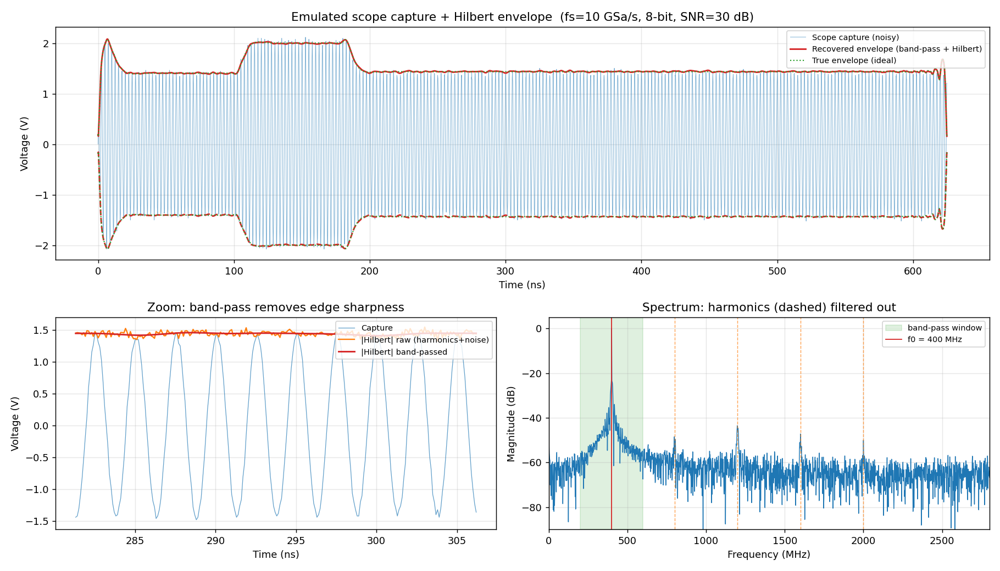

# hilberttest


Hilbert transform of a time-domain `Vout` trace exported from Keysight ADS.
The script reads an ADS-style CSV (multi-line metadata header, per-cell unit
suffixes like `psec` / `nsec` / `mV` / `V`), computes the analytic signal via
`scipy.signal.hilbert`, and plots the original waveform with the +/- envelope
overlaid.

## Usage

```bash
pip install -r requirements.txt
python hilbert_envelope.py --save envelope.png
```

By default the script reads the path baked into `DEFAULT_CSV`. Override with
`--csv path/to/other.csv`, or pass `--show` to open the plot interactively.

## Parametric sweep (L1 = 50–130 nH)

`sweep_envelopes.py` runs the same envelope analysis across an ADS L1 sweep
(`S02LSweep50130R2.csv` — 81 values from 50 to 130 nH in 1 nH steps):

```bash
python sweep_envelopes.py
```

- `sweep_all/` — one plot per L1 value (`L1_050nH.png` … `L1_130nH.png`, 81 total)
- `sweep_every10nH/` — only the 10 nH increments (`step10_L1_050nH.png` … `step10_L1_130nH.png`, 9 total)

## Realistic lab-acquisition pipeline



`lab_pipeline.py` emulates what you'd actually measure on the bench — probe +
oscilloscope, not an ideal simulation — and then extracts the envelope:

```bash
python lab_pipeline.py --snr 30 --bits 8 --fs 10e9 --scope-bw 2e9
```

Stages: de-dup timestamps → resample to a uniform scope clock → band-limit to
the scope's analog bandwidth → add Gaussian noise at a target SNR → quantize to
an N-bit ADC → band-pass around the carrier → `|Hilbert|` envelope. The
band-pass is what removes the carrier's harmonics and edge sharpness, so the
recovered envelope stays smooth; at 30 dB SNR / 8-bit it tracks the ideal
envelope to ~0.5 % of full span.

> Note: ADS exports a few duplicate-timestamp rows at checkpoint times
> (100/181 ns); a real scope's fixed sample clock never does this. The loaders
> now drop them (`dedup_time`), which also removes the envelope spikes those
> rows caused.

## Files

- `hilbert_envelope.py` — loader + Hilbert envelope plotter (single trace)
- `sweep_envelopes.py` — batch envelope plots across an L1 parametric sweep
- `lab_pipeline.py` — realistic scope-acquisition + envelope pipeline
- `requirements.txt` — `numpy`, `scipy`, `matplotlib`
- `envelope.png`, `lab_pipeline.png` — generated plots (committed for reference)
- `sweep_all/`, `sweep_every10nH/` — generated sweep plots
